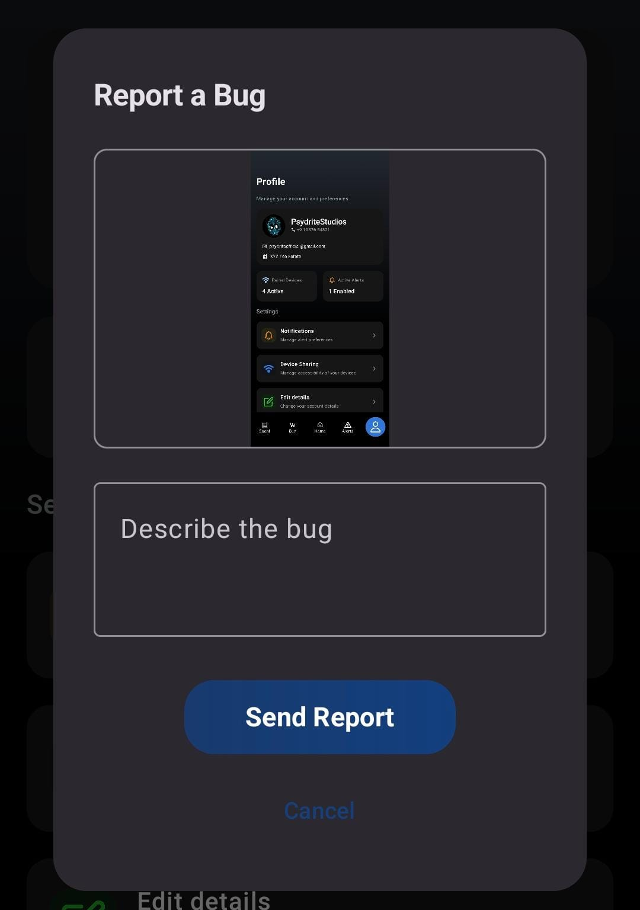
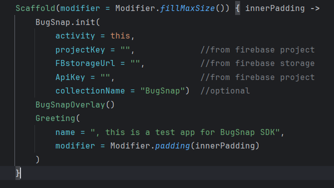
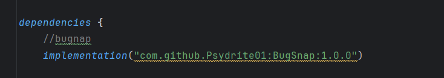
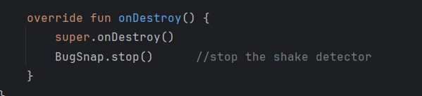

# BugSnap - In-App Bug Reporting SDK for Android

> **Important:** BugSnap currently **only supports Firebase** as the backend for storing bug reports. Support for other providers may be added in the future.

BugSnap is a lightweight Android SDK that enables in-app bug reporting with screenshots. When users shake their device, BugSnap captures a screenshot, prompts them to describe the issue, and uploads the report to your Firebase project.


---

## Demo

### Bug Report Dialog


### Project Structure


---

## Features

- **Shake to Report** - Users shake the device to trigger bug reporting
- **Automatic Screenshot** - Captures the current screen using PixelCopy API
- **Firebase Integration** - Stores screenshots in Firebase Storage and reports in Firestore
- **Material 3 UI** - Clean, modern dialog that matches your app's theme
- **Drop-in Integration** - Initialize in one line, works automatically

---

## Installation

### 1. Add JitPack to your project

In your root `settings.gradle.kts` (or `build.gradle.kts` for older projects):

```kotlin
dependencyResolutionManagement {
    repositories {
        mavenCentral()
        maven("https://jitpack.io")
    }
}
```

### 2. Add the dependency

In your app module's `build.gradle.kts`:

```kotlin
dependencies {
    implementation("com.github.Psydrite01:BugSnap:1.0.0")
}
```



### 3. Sync your project

Click **Sync Now** in Android Studio to download the dependency.

---

## Firebase Setup

BugSnap requires a Firebase project with **Storage** and **Firestore** enabled.

### Step 1: Create a Firebase Project

1. Go to [Firebase Console](https://console.firebase.google.com/)
2. Click **Add project** and follow the setup wizard
3. Add your Android app (use your app's package name)
4. Download `google-services.json` and place it in your app module

### Step 2: Enable Firebase Storage

1. In Firebase Console, go to **Storage**
2. Click **Get started**
3. Start in **test mode** (or configure rules for production)

### Step 3: Enable Firestore Database

1. In Firebase Console, go to **Firestore Database**
2. Click **Create database**
3. Choose your region
4. Start in **test mode** (or configure rules for production)

### Step 4: Get Your Credentials

1. Go to **Project Settings** (gear icon)
2. Under **General**, find your **Project ID**
3. Go to **Service accounts** tab
4. Click **Generate new private key** to get your API credentials (or use Web API Key from Firebase Console settings)

---

## Usage

### Basic Setup

Initialize BugSnap in your `MainActivity` or Application class:

```kotlin
import com.psydrite.bugsnap.BugSnap
import com.psydrite.bugsnap.BugSnapOverlay

class MainActivity : ComponentActivity() {
    override fun onCreate(savedInstanceState: Bundle?) {
        super.onCreate(savedInstanceState)
        
        // Initialize BugSnap SDK
        BugSnap.init(
            activity = this,
            projectKey = "your-project-id",      // Firebase Project ID
            FBstorageUrl = "your-project-id.appspot.com",  // Storage bucket
            ApiKey = "your-web-api-key",         // Firebase Web API Key (optional for public projects)
            collectionName = "BugSnap"           // Optional: custom Firestore collection name
        )
        
        setContent {
            YourAppContent()
            // Add the overlay composable to enable bug reporting
            BugSnapOverlay()
        }
    }
    
    override fun onDestroy() {
        super.onDestroy()
        BugSnap.stop()  // Clean up resources
    }
}
```



### Where to Get Credentials

| Parameter | Description | Where to Find |
|-----------|-------------|---------------|
| `projectKey` | Your Firebase Project ID | Project Settings > General > Project ID |
| `FBstorageUrl` | Your Storage bucket name | Storage > Files (usually `<project-id>.appspot.com`) |
| `ApiKey` | Firebase Web API Key | Project Settings > Service accounts > Web API Key |
| `collectionName` | Firestore collection name | Optional, defaults to `"BugSnap"` |

### Getting Your Firebase Web API Key

1. Go to **Firebase Console**
2. Click the **gear icon** (Project Settings)
3. Scroll down to **Your apps**
4. Under **Web API Key**, click **Add key** or copy existing key

---

## How It Works

1. User **shakes** the device
2. BugSnap **captures** a screenshot of the current screen
3. A dialog appears with the screenshot preview
4. User **describes** the bug
5. BugSnap **uploads** the screenshot to Firebase Storage
6. BugSnap **saves** the report (URL + description) to Firestore

---

## Firebase Security Rules

> **If BugSnap is not uploading reports, check your Firebase Security Rules.**

### Storage Rules (test mode)

```
rules_version = '2';
service firebase.storage {
  match /b/{bucket}/o {
    match /{allPaths=**} {
      allow read, write: if request.time < timestamp.date(2025, 12, 31);
    }
  }
}
```

### Production Storage Rules

```
rules_version = '2';
service firebase.storage {
  match /b/{bucket}/o {
    match /BugSnap/{fileName} {
      allow write: if request.auth != null;
      allow read: if request.auth != null;
    }
  }
}
```

### Firestore Rules (test mode)

```
rules_version = '2';
service cloud.firestore {
  match /databases/{database}/documents {
    match /{document=**} {
      allow read, write: if request.time < timestamp.date(2025, 12, 31);
    }
  }
}
```

### Production Firestore Rules

```
rules_version = '2';
service cloud.firestore {
  match /databases/{database}/documents {
    match /BugSnap/{reportId} {
      allow write: if request.auth != null;
      allow read: if request.auth != null;
    }
  }
}
```

---

## Troubleshooting

| Issue | Solution |
|-------|----------|
| Shake not working | Ensure the device has an accelerometer. Emulators may not simulate shake properly. |
| Screenshot is blank | PixelCopy requires API 26+. Make sure your device meets the minimum SDK. |
| Upload fails (403) | Check your Firebase Storage rules. Test mode allows writes; production requires authentication. |
| Upload fails (401) | Verify your Web API Key is correct and has the necessary permissions. |
| Report not in Firestore | Check Firestore rules and ensure the collection name matches. |
| Dialog doesn't appear | Ensure `BugSnapOverlay()` is added to your Compose content tree. |

---

## Requirements

- **Minimum SDK:** API 26 (Android 8.0)
- **Kotlin:** 2.0.21
- **Android Gradle Plugin:** 8.9.1
- **Firebase Project** with Storage and Firestore enabled

---

## Dependencies

BugSnap uses:
- **Jetpack Compose** (BOM 2026.03.01)
- **Material 3**
- **OkHttp 4.12.0**
- **Kotlin Coroutines 1.9.0**

---

## License

MIT License - feel free to use in your projects!

---

## Support

Found a bug or have a feature request? [Open an issue](https://github.com/Psydrite01/BugSnap/issues) on GitHub.
